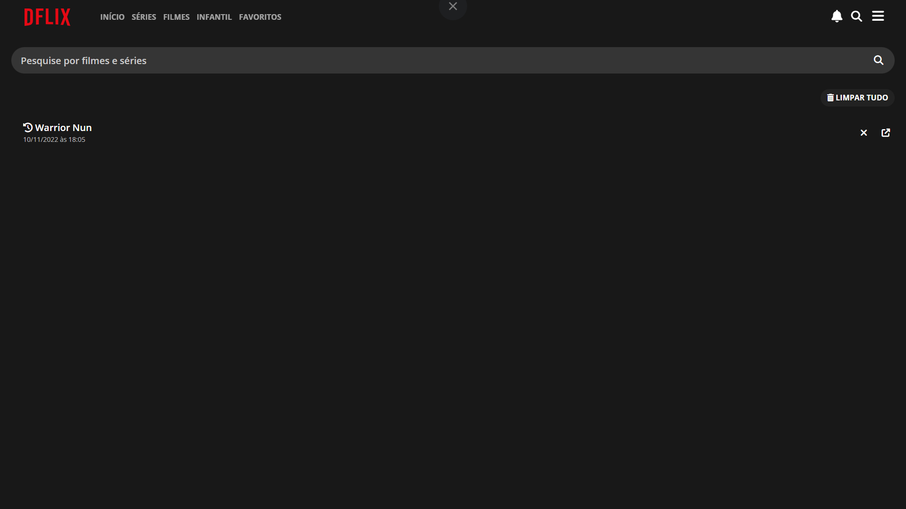

# DFLIX

A [DFLIX](www.dflix.online) é um  projeto feito com React, que consome as api's de filmes e séries do ***The movie database*** (informações dos filmes e séries), e ***Warez cdn*** (Video dos filmes e séries).

Sendo possível encontrar informações de filmes e séries como: Nome e descrição, elenco, data de lançamento, duração, avaliações, comentários, trailers, pesquisar filmes, séries e atores. E, atráves do warez cdn, ter acesso aos filmes e séries disponíveis.
 
 
 

## `|Página Inicial`

Na página inicial é possivel encontrar filmes e séries mais populares do momento, podendo escolher entre mais populares ou mais bem avaliadas (Féries) e, populares, lançamentos e mais bem avaliados (Filmes).

## `|Página Filme/Série`

Na página de filme ou série é possivel encontrar as suas principais informações, como: elenco, data de lançamento, avaliação, gêneros, trailers, comentários, sugestões de filmes/série, com opções de compartilhamento e adicionar aos favoritos.

## `|Página 'Pessoa'`

Na página 'pessoa' é possível encontrar informações do(a) ator/atriz, diretores e dubladores: Nome, biográfia, idade, ano de nascimento, cidade natal e filmes/séries participadas.

## `|Página Pesquisar`

Na página pesquisar é possível pesquisar filmes, séries e pessoas (atores, atrizes, dubladores e diretores). contém histórico de pesquisas e opção de visualizar apenas filme, série, ou pessoa.

## `|Pagina Generos`

Na Página de gêneros é possivel econtrar os filmes e séries de acordo com o gênero desejado.

## `|Pagina Favoritos`

Na página favoritos é possivel visualizar séries e filmes salvos como favoritos

